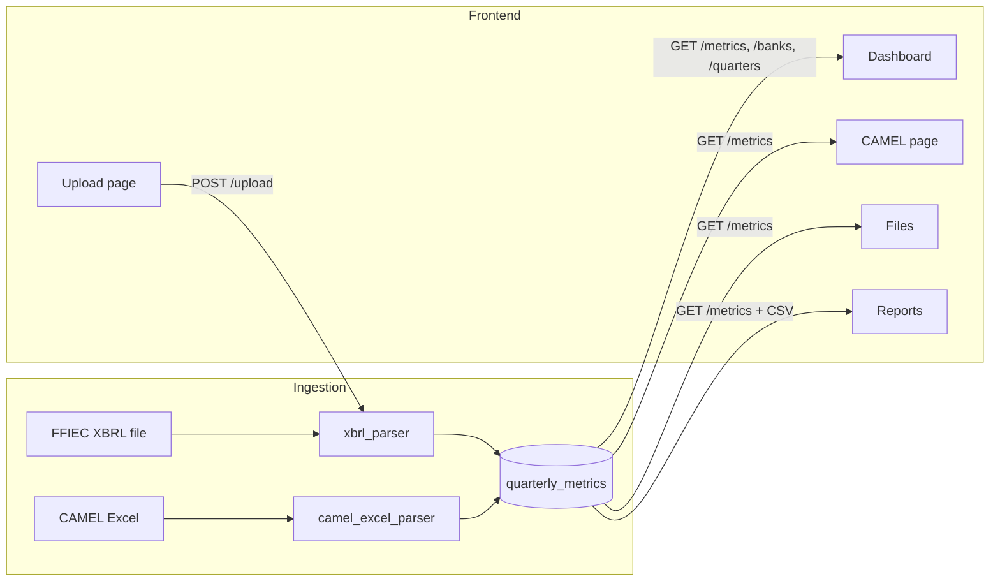

# Viking App Analysis and New-Feature Plan

## 1. What the code does (summary)

**Viking** is a full-stack **Competitor Bank Analytics** internal dashboard that automates the workflow that used to require manually downloading quarterly data from the [FFIEC Central Data Repository (CDR)](https://cdr.ffiec.gov/public/ManageFacsimiles.aspx) and re-entering it into Excel.

### Backend ([backend/](backend/))

- **FastAPI** app with SQLite ([database.py](backend/database.py), [models.py](backend/models.py)). Single table: `quarterly_metrics` — one row per `(bank_id, year, quarter, metric_name, value)`.
- **Two ingestion paths:**
  1. **XBRL (FFIEC Call Report)**
    [xbrl_parser.py](backend/xbrl_parser.py) parses instance XML (and optionally Arelle). Detects FFIEC format via `ffiec.gov/xbrl/call/concepts` and maps FFIEC concept codes (e.g. RIAD4074, RCONG641, RCOND990) to canonical metrics: revenue, net_profit, deposits, loans_outstanding, customer_accounts, total_assets, total_equity, tier1_leverage_ratio, past_due, nonaccrual, brokered_deposits, NIM/ROA/ROE inputs, etc. Bank/year/quarter can be provided on upload or read from the file.
  2. **CAMEL Excel (WSB Performance Dashboard style)**
    [camel_excel_parser.py](backend/camel_excel_parser.py) uses openpyxl to read sheets like "FY24"/"FY 25", headers "Q1 24 WSB", etc., and maps labels to canonical CAMEL metrics (Equity to Assets, Tier 1 Leverage, Efficiency Ratio, ROA, ROE, NIM, growth rates, liquidity ratios, etc.).
- **API:** `POST /upload` (XBRL), `POST /upload-camel-excel` (Excel), `GET /banks`, `GET /quarters`, `GET /metrics` (with optional filters), `DELETE /upload` (by bank/year/quarter). Security headers and CORS for localhost frontend.

### Frontend ([frontend/src/](frontend/src/))

- **React + Vite**, React Router. Layout: header “Competitor Bank Analytics”, sidebar, main content, footer (About, Privacy, Terms).
- **Pages:**
  - **Upload Data** ([UploadPage.tsx](frontend/src/pages/UploadPage.tsx)): Form for **XBRL only** — bank (existing or new), year, quarter, file (.xbrl/.xml). No UI for CAMEL Excel yet (API exists in [client.ts](frontend/src/api/client.ts) as `uploadCamelExcel`).
  - **Dashboard** ([DashboardPage.tsx](frontend/src/pages/DashboardPage.tsx)): Filters (bank, year, quarter) → GET /metrics. Renders summary KPIs, revenue-by-bank bar chart, revenue share donut, metric breakdown donut, quarterly growth line chart, and a table (bank / year / quarter / revenue / growth %) via [metricsTransform.ts](frontend/src/utils/metricsTransform.ts).
  - **CAMEL** ([ScoreboardPage.tsx](frontend/src/pages/ScoreboardPage.tsx)): Bank + period selector; “Add column” adds a (bank, year, quarter) slice. Table: CAMELS categories (Capital, Asset Quality, Management, Earnings, Liquidity, Sensitivity) and strategic metrics. Values come from (1) stored CAMEL Excel metrics, or (2) **derived from XBRL** in the browser via `deriveCamelValues()` (ROA, ROE, NIM, efficiency ratio, loan/deposit growth, liquidity ratios, etc.) using raw FFIEC metrics.
  - **Files** ([FilesPage.tsx](frontend/src/pages/FilesPage.tsx)): Browse uploads by year/quarter (folder-style), delete an upload.
  - **Reports** ([ReportsPage.tsx](frontend/src/pages/ReportsPage.tsx)): Same filters, table preview, **Download CSV** (bank, year, quarter, revenue, growth %).
  - **About / Privacy / Terms**: Static content.

### Data flow (high level)

---

## 2. What the website serves (purpose)

- **Primary purpose:** Replace manual “download from FFIEC CDR → type into Excel” with: upload XBRL (and optionally CAMEL Excel), store once, then view dashboards and CAMEL scoreboard and export CSV — saving the bank president (and staff) many hours per quarter.
- **Audience:** Internal (bank leadership / analysts). One bank’s use case today; the product is built so other banks could use it.
- **Value delivered:**  
  - Single place to store competitor (and own) quarterly data from FFIEC-style XBRL and WSB-style CAMEL Excel.  
  - Dashboard: compare revenue, growth, deposits, loans across banks/quarters.  
  - CAMEL view: side-by-side periods/banks with regulator-style ratios, many computed from XBRL.  
  - Export to CSV for further use.

**Gap:** The Upload page only supports XBRL; CAMEL Excel upload exists in the API but has no UI, so completing that would round out the current scope.

---

## 3. New features to increase demand from other banks

The following are **new-feature ideas** (not implementation steps in this repo yet) that would make the product more attractive to other banks and differentiate it from “manual Excel + occasional FFIEC downloads.”

| Feature                                | Why it increases demand                                                                                                                                                                                                                                 |
| -------------------------------------- | ------------------------------------------------------------------------------------------------------------------------------------------------------------------------------------------------------------------------------------------------------- |
| **1. CAMEL Excel upload in Upload UI** | Completes the product: one page for both XBRL and WSB-style Excel so banks don’t need to call the API manually.                                                                                                                                         |
| **2. FFIEC CDR / PDD integration**     | FFIEC offers [PDD Web Services](https://cdr.ffiec.gov/public/ManageFacsimiles.aspx) and bulk data. A “Fetch from FFIEC” or “Import from CDR” (e.g. by institution ID and quarter) would reduce manual download/upload and appeal to any bank using CDR. |
| **3. Peer group comparison**           | Let the user define or select a peer group (e.g. by asset size, state). Show “Your bank vs peers” (averages or percentiles) on Dashboard and CAMEL. Requires peer definitions and, ideally, peer data (from FFIEC/UBPR or user-uploaded).               |
| **4. Benchmarking and percentiles**    | For key ratios (ROA, ROE, NIM, efficiency, loan/deposit ratio), show percentile rank vs peer group or vs all loaded banks. “You’re in the 75th percentile for ROA.”                                                                                     |
| **5. Alerts and thresholds**           | Notify when a metric crosses a threshold (e.g. competitor deposit growth > 15%, or our NIM < 2.5%). Configurable per bank/metric with optional email/digest.                                                                                            |
| **6. Time-series and trends**          | Historical line charts for selected banks and metrics (e.g. ROA, NIM, deposits over 8 quarters). Simple trend or “next quarter” projection would add analytical value.                                                                                  |
| **7. Richer exports**                  | Excel (.xlsx) and PDF report (e.g. one-page summary + CAMEL table) in addition to CSV. Scheduled “quarterly report” email.                                                                                                                              |
| **8. UBPR alignment**                  | Align metric names and groupings with UBPR (Uniform Bank Performance Report) so the dashboard “speaks the same language” as examiners and existing UBPR users.                                                                                          |
| **9. Multi-user and audit trail**      | Optional login, “who uploaded what and when,” and role-based access so larger banks can adopt it with accountability.                                                                                                                                   |
| **10. White-label / branding**         | Let another bank deploy the app with their logo and name (e.g. “Acme Bank Competitor Analytics”) to make it an internal product they can share with their board.                                                                                        |

---

## 4. Priority feature set (selected)

**Features 2, 3, 4, and 5** are the priority for increasing demand:

- **2. FFIEC CDR / PDD integration** – Fetch or import by institution ID + quarter; less manual download/upload.
- **3. Peer group comparison** – Define/select peer group (e.g. asset size, state); "Your bank vs peers" on Dashboard and CAMEL.
- **4. Benchmarking and percentiles** – Percentile rank for key ratios (ROA, ROE, NIM, etc.) vs peer group or all loaded banks.
- **5. Alerts and thresholds** – Notify when a metric crosses a threshold (e.g. competitor deposit growth > 15%, or our NIM < 2.5%); configurable per bank/metric, optional email/digest.

These four fit together: **2** improves data inflow; **3** and **4** add peer context and ranking; **5** adds proactive monitoring.

---

## 5. Suggested implementation order

- **First:** FFIEC CDR/PDD integration (2) – enables richer data; foundation for peer/benchmark data if using FFIEC bulk data.
- **Second:** Peer group comparison (3) and benchmarking/percentiles (4) – “pull by ID + quarter”) and peer group + percentiles build on peer group or all-bank aggregates.
- **Third:** Alerts and thresholds (5) – backend rules and checks (cron or on data change); frontend rule config and notification preferences (in-app and optionally email). Optional quick win: CAMEL Excel in Upload UI (feature 1).

---

## 6. High-level next steps for priority features (2–5)

**Priority next steps (2–5):** Feature 2: FFIEC CDR/PDD – research PDD Web Services, add fetch-by-ID+quarter endpoint, reuse existing parser. Feature 3: Peer groups – DB + CRUD API, my bank designation, Dashboard/CAMEL compare view. Feature 4: Percentiles – backend endpoint for key metrics vs peer/all; frontend badge or column. Feature 5: Alerts – alert_rules table, background check, alert_events, CRUD API, Alerts page and optional email.

---

## 7. Files to touch for “complete current scope” (CAMEL Excel in UI)

- [frontend/src/pages/UploadPage.tsx](frontend/src/pages/UploadPage.tsx): Add a second upload mode or file type (e.g. “XBRL” vs “CAMEL Excel”), second form or same form with `accept=".xlsx"` and call `uploadCamelExcel`; show success/error for Excel same as for XBRL.
- Optionally [frontend/src/components/Layout.tsx](frontend/src/components/Layout.tsx) or copy: no change unless you add a nav hint. Sidebar already has Upload.

No backend changes required for CAMEL Excel UI; the API is already in place.